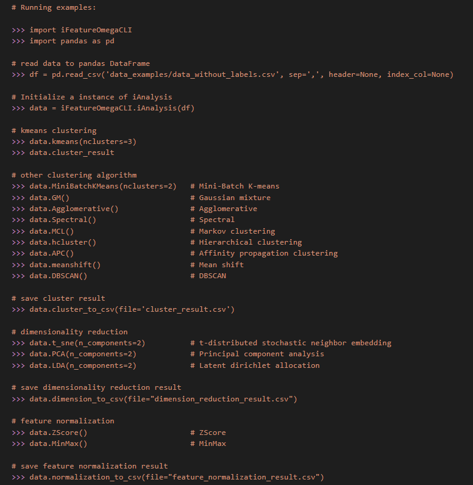

# *iFeatureOmega* - an integrative platform for the feature engineering, visualization and analysis of features from molecular sequence, structural and ligand data sets. 

## Introduction
*iFeatureOmega* is a comprehensive platform for generating, analyzing and visualizing more than 180 representations for biological sequences, 3D structures and ligands. To the best of our knowledge, *iFeatureOmega* supplies the largest number of feature extraction and analysis approaches for most molecule types compared to other pipelines. Three versions (i.e. *iFeatureOmega-Web*, *iFeatureOmega-GUI* and *iFeatureOmega-CLI*) of *iFeatureOmega* have been made available to cater to both experienced bioinformaticians and biologists with limited programming expertise. *iFeatureOmega* also expands its functionality by integrating 15 feature analysis algorithms (including ten cluster algorithms, three dimensionality reduction algorithms and two feature normalization algorithms) and providing nine types of interactive plots for statistical features visualization (including histogram, kernel density plot, heatmap, boxplot, line chart, scatter plot, circular plot, protein three dimensional structure plot and ligand structure plot). *iFeatureOmega* is an open-source platform for academic purposes. The web server can be accessed through https://ifeatureomega.erc.monash.edu and the GUI and CLI versions can be download at:  https://github.com/Superzchen/iFeatureOmega-GUI and https://github.com/Superzchen/iFeatureOmega-CLI, respectively.

## Running environment
  *iFeatureOmega* is an open-source Python-based toolkit, which operates in the Python environment (Python version 3.7) and can run on multiple operating systems (such as Windows, Mac and Linux). Prior to installing and running *iFeatureOmega*, all the dependencies should be installed in the Python environment, including biopython, networkx, numpy (>=1.21.4), pandas (>=1.3.4), scikit-learn (>=1.0.1), scipy (>=1.7.3), matplotlib (**3.4.3**), qdarkstyle, sip, datetime, seaborn and joblib. **For convenience, we strongly recommended users to install the Anaconda Python environment in your local computer. The software can be freely downloaded from https://www.anaconda.com/.**
  
## Installation

  - Step 1. Download and install the anaconda platform
  ```sh  
  Download anaconda from:https://repo.anaconda.com/archive/ (Version: 2020.02)  
  ```  

  - Step 2. Install anaconda environment on your own machine and make sure the “Add Anaconda to the system PATH environment variable” option is selected when installation

  - Step 3. Install MSMS, DSSP, RDKit, biopython and networkx
  ```sh  
  $ conda install biopython
  $ conda install -c rdkit rdkit
  $ conda install -c salilab dssp
  $ conda install -c bioconda msms
  $ conda install networkx
  ``` 
  **Note:** dssp and msms can not be install on Windows system.
  
  - Step 4. Install *iFeatureOmega* through pip3
  ```sh  
  # GUI version
  pip3 install iFeatureOmegaGUI

  # CLI version
  pip3 install iFeatureOmegaCLI
  ```
  
  - Step 4. run *iFeatureOmega*:
  ```sh
  # GUI version
  $ python
  >>> from iFeatureOmegaGUI import runiFeatureOmegaGUI
  >>> runiFeatureOmegaGUI()
  ```

  ```sh
  # CLI version
  $ python
  >>> import iFeatureOmegaCLI
  >>> dna = iFeatureOmegaCLI.iDNA('<abs_path>/data_examples/DNA_sequences.txt')
  >>> dna.display_feature_types()
  >>> dna.import_parameters('<abs_path>/parameters/DNA_parameters_setting.json')
  >>> dna.get_descriptor("Kmer")
  >>> print(dna.encodings)
  >>> dna.to_csv("Kmer.csv", "index=False", header=False)
  ```
 

## Brief guidance to use (GUI version):  
Please refer to [*iFeatureOmega* manual](https://github.com/Superzchen/iFeatureOmega-CLI/blob/main/docs/iFeatureOmega_manual.pdf) for detailed usage.
  
## *iFeatureOmegaGUI* interfaces:

### *iFeatureOmegaGUI* main interface:
  


### For the GUI-based version, seven tab-widgets are included and different functionalities are accessible by switching among tabs. Taking feature descriptor extraction of DNA sequences as an example:
  
  - *Step 1. Open the sequence file*

  Click the “Open” button and select the DNA sequences file (e.g. “DNA_sequences.txt” in “data” directory of iFeatureOmegaGUI package).

  - *Step 2. Select the feature descriptor and configure the descriptor parameters*

  Select one or more feature descriptor(s) and set the corresponding parameters with the parameter dialog box.

  - *Step 3. Run the program*

  Click the “Start” button to calculate the descriptor features. The feature encoding and graphical presentation will be displayed in the “Data”, “Data distribution”, “Heatmap”, “Boxplot” and “Circular plot” panels, respectively.

  - *Step 4. Save results and plots*

  Click the “Save” button to save the generated feature encodings. iFeatureOmega supports four formats for saving the calculated features, including LIBSVM, CSV, TSV, and WEKA format, so as to facilitate direct use of the features in the following analysis, prediction model construction and the third-party computational tools, such as scikit-learn and WEKA. In addition, iFeatureOmega provides the TSV1 format, which includes the sample and feature labels. All the plots in iFeatureOmega are generated by the matplotlib library and can be saved to a variety of image formats, such as PNG, JPG, PDF, TIFF etc).  


## Brief guidance to use (CLI version):  
Please refer to [*iFeatureOmega* manual](https://github.com/Superzchen/iFeatureOmegaGUI/blob/main/docs/iFeatureOmega_manual.pdf ) for detailed usage.

### There were seven main python class in *iFeatureOmega-CLI*, including “iProtein”, “iDNA”, “iRNA”, “iStructure” and “iLigand”, which are feature extraction methods for protein sequences, DNA sequences, RNA sequences, protein structures and ligand molecules, respectively. “iAnalysis” class is also equipped for feature analysis, while “iPlot” class is used to generate the corresponding plots. In each class, we provide the example code, users can run the following command view the example code for “iAnalysis” class. 

  ```sh
  $ python
  >>> import iFeatureOmegaCLI
  >>> print(iFeatureOmegaCLI.iAnalysis.__doc__)
  ```



### Example for feature analysis using iFeatureOmegaCLI

  - *Step 1. Open a data file*

  ```sh
  $ python
  >>> import iFeatureOmegaCLI
  >>> import pandas as pd
  >>> df = pd.read_csv('<abs_path>/data_examples/data_without_labels.csv', sep=',', header=None, index_col=None)
  ```

  - *Step 2. Create an instance for “iAnalysis” class*

  ```sh 
  >>> data = iFeatureOmegaCLI.iAnalysis(df) 
  ```

  - *Implement an analysis algorithm and save analysis result*

  ```sh 
  >>> data.kmeans(nclusters=3)            # k-means clustering
  >>> data.MiniBatchKMeans(nclusters=2)   # Mini-Batch K-means
  >>> data.GM()                           # Gaussian mixture
  >>> data.Agglomerative()                # Agglomerative
  >>> data.Spectral()                     # Spectral
  >>> data.MCL()                          # Markov clustering
  >>> data.hcluster()                     # Hierarchical clustering
  >>> data.APC()                          # Affinity propagation clustering 
  >>> data.meanshift()                    # Mean shift
  >>> data.DBSCAN()                       # DBSCAN

  # save cluster result
  >>> data.cluster_to_csv(file="cluster_result.csv")

  # dimensionality reduction
  >>> data.t_sne(n_components=2)          # t-distributed stochastic neighbor embedding
  >>> data.PCA(n_components=2)            # Principal component analysis
  >>> data.LDA(n_components=2)            # Latent dirichlet allocation

  # save dimensionality reduction result
  >>> data.dimension_to_csv(file="dimension_reduction_result.csv")

  # feature normalization
  >>> data.ZScore()                       # ZScore
  >>> data.MinMax()                       # MinMax

  # save feature normalization result
  >>> data.normalization_to_csv(file="feature_normalization_result.csv")
  ```

## Citation
If you find *iFeatureOmega* useful, please kindly cite the following paper:

Zhen Chen, Xuhan Liu, Pei Zhao, Chen Li, Yanan Wang, Fuyi Li, Tatsuya Akutsu, Chris Bain, Robin B. Gasser, Zuoren Yang*, Lukasz Kurgan*, Jiangning Song*, *iFeatureOmega* – an integrative platform for the feature engineering, visualization and analysis of features from molecular sequence, structural and ligand data sets. *Nucleic Acids Research* , 2022.
  
Zhen Chen, Pei Zhao, Fuyi Li, André Leier, Tatiana T Marquez-Lago, Yanan Wang, Geoffrey I Webb, A Ian Smith, Roger J Daly*, Kuo-Chen Chou*, Jiangning Song*, *iFeature*: a Python package and web server for features extraction and selection from protein and peptide sequences. *Bioinformatics*, 2018, 34(14): 2499–2502. https://doi.org/10.1093/bioinformatics/bty140

Zhen Chen, Pei Zhao, Fuyi Li, Tatiana T Marquez-Lago, André Leier, Jerico Revote, Yan Zhu, David R Powell, Tatsuya Akutsu, Geoffrey I Webb, Kuo-Chen Chou, A Ian Smith, Roger J Daly, Jian Li, Jiangning Song*, *iLearn*: an integrated platform and meta-learner for feature engineering, machine-learning analysis and modeling of DNA, RNA and protein sequence data. *Briefings in Bioinformatics*, 2020, 21(3): 1047–1057. https://doi.org/10.1093/bib/bbz041

Zhen Chen, Pei Zhao, Chen Li, Fuyi Li, Dongxu Xiang, Yong-Zi Chen, Tatsuya Akutsu, Roger J Daly, Geoffrey I Webb, Quanzhi Zhao*, Lukasz Kurgan*, Jiangning Song*, *iLearnPlus*: a comprehensive and automated machine-learning platform for nucleic acid and protein sequence analysis, prediction and visualization.  *Nucleic Acids Research* , 2021;, gkab122, https://doi.org/10.1093/nar/gkab122
